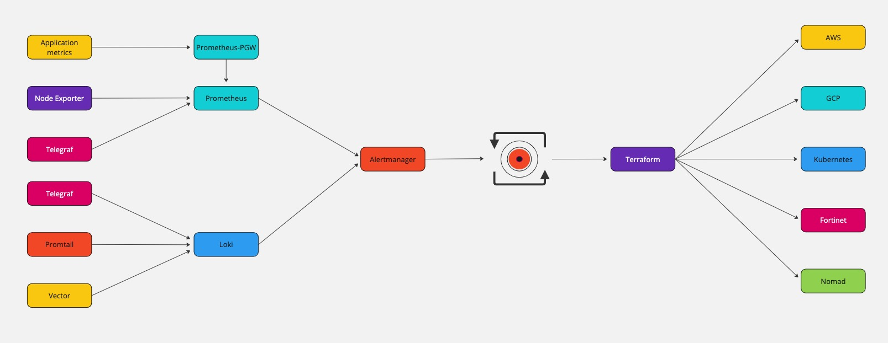

# Iterator (Alertmanager-Terraform-Sync)

## Description
Iterator is an event listener that automates infrastructure management by bridging monitoring (Alertmanager) and infrastructure as code (Terraform) into one tool. Allowing teams to plan ahead and design responses based on observability, from infrastructure logs to application usage analytics, to virtually any definable alert. A simple trigger/action engine that enables highly iterable lifecycles by reducing the manual involvement in the planning phase as well as infrastructure operability.

## High level workflow

Iterator allows to turn metrics and events into actionable data and to take action on that data.

## Uses cases
### Event driven development to step up from automation to autonomy
Leverage modern and robust monitoring tools that can send alerts to Alertmanager to design infrastructure reactivity to predicted events to ensure continuous operability within your organization.
### High velocity disaster recovery and security action
Automate immediate actions on incidents whether they are small or disastrous and revoke or destroy resources upon suspicious activity.
### Design an infrastructure that evolves with your company
Align capacity planning and different architectures that are relevant to your organization's context like a minimalistic cloud deployment when in early stages to a full blown infrastructure in later phases.
### Design an infrastructure that evolves with your product
Orchestrate your infrastructure based on your application's usage data by using Iterator as part of your backend logic, making it natural to extend it to other infrastructure technologies and service providers.
### Start building towards Highly Iterable lifecycles
Integrate deeply your infrastructure lifecycle with your application's roadmap by codifying business decisions like the expansion of your application. Use Iterator to deploy your infrastructure to a new region to follow your users geographically by sensing your application's popularity across the globe.

## OS support
Iterator is only available for Linux.

## Usage
### Installation
```bash
wget https://github.com/cloudputation/iterator/releases/download/${VERSION}/iterator -O ./iterator
chmod +x ./iterator
mv ./iterator /usr/local/bin/
```
### Run service with an alternative config file location
```bash
iterator -f config file
```
### Run as a docker container
```bash
sudo docker run -d \
  -v ${HOME_ITERATOR_DATA}:${DOCKER_ITERATOR_DATA} \
  # If Terrafom modules are not in the data directory
  -v ${HOME_ITERATOR_TERRAFORM_MODULES}:${DOCKER_ITERATOR_TERRAFORM_MODULES} \
  --name iterator cloudputation/iterator:latest
```

## Configuration
By default, Iterator looks for `/etc/iterator/config.hcl`

Here is an example server config file
```hcl
server {
  data_dir  = "/var/lib/iterator"
  log_dir   = "/var/log/iterator"
  log_level = "info"
  // Default port is 9595
  listen    = "9595"
  terraform_driver  = "terraform"
  consul {
    address = "localhost:8500"
  }
}

task {
  name        = "Task1"
  description = "Manage infrastructure for web service"
  source      = "/var/lib/iterator/terraform-data/moduleA"
  condition "label-match" {
    // Set to false to prevent non-zero exit codes from this command, from notifying alertmanager that the command failed.
    // Notifying alertmanager (HTTP 500) is likely to re-dispatch the alarm back to am-executor.
    notify_on_failure = false
    // Send a SIGUSR1 signal to the process if it's still running when the triggering alert resolves.
    // Default signal when not specified is SIGKILL.
    resolved_signal   = "SIGUSR1"
    // Don't signal command if a matching 'resolved' message is
    // sent from alertmanager while this command is still running.
    ignore_resolved   = true
    // User defined labels that match an alert
    label {
      alertname = "my_cool_alert"
      severity  = "warning"
    }
  }
}

task {
  name        = "Task2"
  description = "Manage infrastructure for database service"
  source      = "/var/lib/iterator/terraform-data/moduleB"
  condition "label-match" {
    notify_on_failure = false
    resolved_signal   = "SIGUSR1"
    ignore_resolved   = true
    label {
      alertname = "the_other_cool_alert"
      severity  = "boiling_hot"
    }
  }
}
```

## Sawtooth Scheduling Mode
Iterator allows for a forward-only Terraform deployment mode which prevent it to destroy the resource when the corresponding alert is resolved. To destroy the resource, use the `release` subcommand.
```bash
iterator release [alert name]
```
Note that the server address has to be configured in the config.hcl file.

### Tip
User the `local-exec` or `remote-exec` provisioners to automated a release based on a second alert task configuration.
```hcl
provisioner "local-exec" {
  command = "iterator release ${var.alert_name}"
}
```

## Consul Backend
Iterator can use Consul as storage backend.

### Consul-Terraform-Sync integration
When enabled, Iterator can serve as a bridge for CTS. Simply replace <alertname> for the actual alert name. CTS can now also operate on alerts. Note that Iterator will still run the Terraform resource at the configured source. You need to make sure that the Terraform resource deploymed will not interfere with the resource deployed by CTS.
```hcl
task {
  name        = "consul_kv_condition_task"
  description = "execute on changes to Consul KV entry"
  module      = "path/to/consul-kv-module"
  providers   = ["my-provider"]

  condition "consul-kv" {
    path                = "iterator::Data/process/alerts/<alertname>"
    recurse             = false
    datacenter          = "dc1"
    namespace           = "default"
    use_as_module_input = true
  }
}
```
Please review [CTS documentation](https://developer.hashicorp.com/consul/docs/nia/tasks#consul-kv-condition) to learn more about configuring tasks based on Consul's KV store.

## Application Metrics
Basic prometheus format metrics can be collected at http://iterator_address:9595/metrics

`am_executor_errors_total`<br>
`am_executor_errors_total`<br>
`am_executor_errors_total`<br>
`am_executor_process_duration_seconds`<br>
`am_executor_process_duration_seconds`<br>
`am_executor_process_duration_seconds`<br>
`am_executor_process_duration_seconds`<br>
`am_executor_process_duration_seconds`<br>
`am_executor_process_duration_seconds`<br>
`am_executor_process_duration_seconds`<br>
`am_executor_process_duration_seconds_sum`<br>
`am_executor_process_duration_seconds_count`<br>
`am_executor_processes_current`<br>
`am_executor_signaled_total`<br>
`am_executor_signaled_total`<br>
`am_executor_signaled_total`<br>
`am_executor_skipped_total`<br>
`am_executor_skipped_total`<br>
`promhttp_metric_handler_errors_total`<br>
`promhttp_metric_handler_errors_total`<br>
